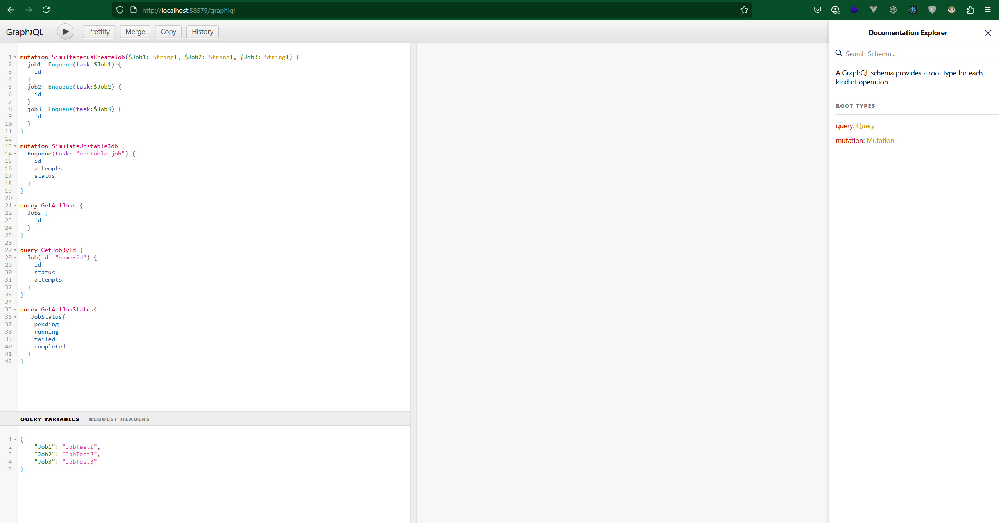

# Simple Distributed Job Queue Simulation
a simple job queue system built by golang

## Requirement:
-> Go >= 1.20

## How to Run:
-> on VsCode -> Run(Pick Go-Debug)
-> open localhost:58579/graphiql
-> should be look like this

## Requirements
make sure you complete all the function stated at first you load graphiql page
1. SimultaneousCreateJob -> build a simultaneous job
2. SimulateUnstableJob -> special case for task "unstable-job" fails twice before passing
3. GetAllJobs -> get all jobs that already registered
4. GetJobById -> get job by the id that been created by enqueue job
5. GetAllJobStatus -> get the stats of all jobs that been processed

## Evaluation Criteria:
* **Correctness**: Job creation, execution, status updates are accurate.
* **Concurrency Safety**: Multiple jobs created/processed at once → no race, no corruption.
* **Idempotency Handling**: Same job/task with same ID or token → doesn't process twice.
* **Retry Logic**: Failing job retries up to N times with delay.
* **In-memory Safety**: Maps/lists used safely under concurrent access.
* **Code Quality**: Idiomatic Go, good naming, clean package layout.
* **Clean Architecture**: Separation of domain, repository, resolver, GraphQL models.
* **Performance Awareness**: Handles 50–100 concurrent jobs without crash or slowdown.
* **Logging and Debugging**: Logs meaningful events.
* **Graceful Failure Handling**: No panics; job failure doesn’t crash system.

# Good Luck Guys